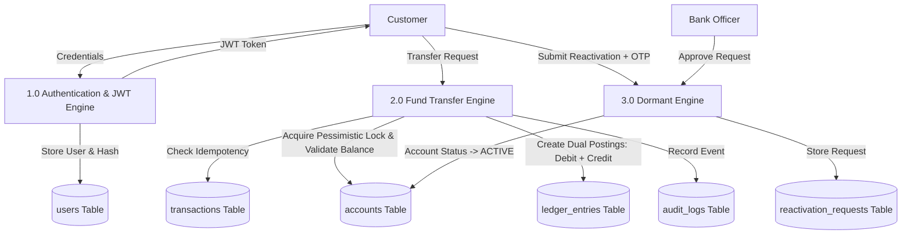
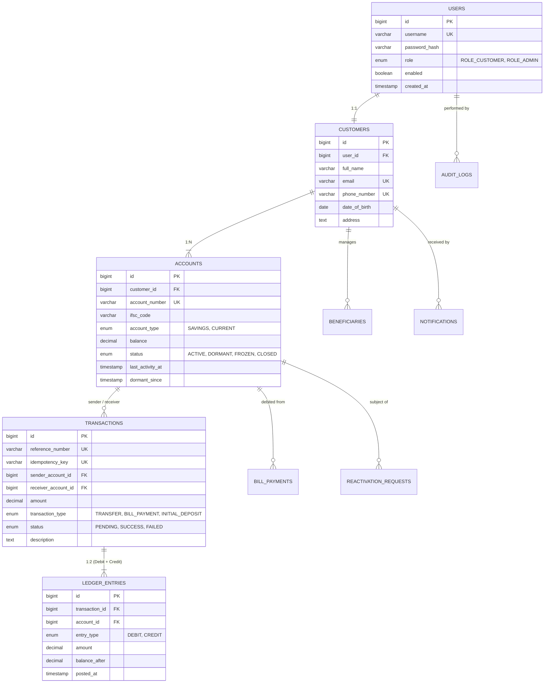

# 🏛️ SecureBank — Comprehensive Academic & System Documentation
> **Tagline:** Secure Transactions. Smarter Banking. A Better Tomorrow.  
> **Course / Degree:** Full-Stack Enterprise Application Engineering / Computer Science & Engineering  
> **Tech Stack:** Java 21 (LTS), Spring Boot 3.3.4, Spring Security 6, JJWT 0.12, MySQL 8.x, React 18, Vite, Tailwind CSS  

---

## 📑 Table of Contents
1. [Project Abstract](#1-project-abstract)
2. [Problem Statement & Motivation](#2-problem-statement--motivation)
3. [System Architecture & Technology Blueprint](#3-system-architecture--technology-blueprint)
4. [Data Flow Diagrams (DFD Level 0, 1, and 2)](#4-data-flow-diagrams-dfd)
5. [Use Case Analysis & Actor Specifications](#5-use-case-analysis--actor-specifications)
6. [Database Schema & Entity Relationship Diagram (ERD)](#6-database-schema--entity-relationship-diagram-erd)
7. [ACID & Concurrency Control Engineering](#7-acid--concurrency-control-engineering)
8. [Double-Entry Ledger Bookkeeping & Mathematical Invariants](#8-double-entry-ledger-bookkeeping--mathematical-invariants)
9. [Security Architecture & Role-Based Access Control](#9-security-architecture--role-based-access-control)
10. [Comprehensive Viva Voce Examination Guide (30 Questions & Answers)](#10-comprehensive-viva-voce-examination-guide)

---

## 1. Project Abstract
**SecureBank** is an enterprise-grade educational online banking and transaction management system designed to model real-world commercial banking software architecture. Modern core banking systems must satisfy strict non-functional constraints: strict consistency (zero balance drift), high concurrency without race conditions, idempotency across unreliable network connections, defensive security against unauthorized transfers, and immutable audit trails for statutory regulatory compliance (RBI / Basel III guidelines).

SecureBank provides:
1. **Real-time Atomic Fund Transfers** executing under `READ_COMMITTED` transaction isolation with **pessimistic row-level write locking** (`SELECT ... FOR UPDATE`) sorted in ascending account ID order to mathematically eliminate deadlocks.
2. **Double-Entry Ledger Bookkeeping** where every transaction simultaneously produces balanced debit and credit entries, guaranteeing that total assets equal total liabilities.
3. **Idempotency Mitigation** via cryptographic idempotency keys, preventing double-billing on network timeouts.
4. **Dormant Account Protection & Step-Up Reactivation** preventing stale account exploitation via automated 90-day dormancy rules and simulated multi-factor OTP + admin approval workflows.
5. **Modern Single-Page Application (SPA)** built with React 18 and Tailwind CSS providing corporate banking UX inspired by leading Indian fintechs (HDFC NetBanking, Razorpay, ICICI iMobile).

---

## 2. Problem Statement & Motivation
In typical academic web projects, banking simulations often treat financial transfers as simple sequential `UPDATE accounts SET balance = balance - 100` queries. In real-world concurrent environments, this naïve approach fails catastrophic failure modes:
- **Lost Updates & Race Conditions**: Two concurrent transfer requests reading ₹10,000 simultaneously can both deduct ₹8,000, overdrawing the account to negative balance.
- **Deadlocks**: Account A transferring to Account B while Account B transfers to Account A locks rows in opposite orders, crashing database connection threads.
- **Duplicate Charges**: Network lag or browser double-clicks create multiple debits without customer consent.
- **Dormant Account Takeover**: Unmonitored inactive accounts become targets for unauthorized fraudulent transfers.

SecureBank addresses all these challenges directly in code with production-grade engineering patterns.

---

## 3. System Architecture & Technology Blueprint

```
┌────────────────────────────────────────────────────────────────────────┐
│                      Client Tier (Browser / React 18)                  │
│       Vite 6 · Tailwind CSS · React Router DOM · Lucide React · Axios  │
└───────────────────────────────────┬────────────────────────────────────┘
                                    │ HTTPS / JSON (Bearer JWT)
                                    ▼
┌────────────────────────────────────────────────────────────────────────┐
│                   Application Gateway / Spring Security 6              │
│       JwtAuthenticationFilter · OncePerRequestFilter · BCrypt           │
│       Role-Based Authorization (ROLE_CUSTOMER, ROLE_ADMIN)             │
└───────────────────────────────────┬────────────────────────────────────┘
                                    │
                                    ▼
┌────────────────────────────────────────────────────────────────────────┐
│                   Spring Boot 3.3.4 REST Controllers                   │
│  AuthController · AccountController · TransactionController           │
│  BeneficiaryController · BillPaymentController · DormantController    │
│  AdminController · AuditController                                     │
└───────────────────────────────────┬────────────────────────────────────┘
                                    │ Injected Service Beans
                                    ▼
┌────────────────────────────────────────────────────────────────────────┐
│                        Business Logic & Domain Layer                   │
│  ┌──────────────────────────────────────────────────────────────────┐  │
│  │  TransactionService: @Transactional, Pessimistic Locking,         │  │
│  │                      Idempotency Check, Ascending ID Lock Order  │  │
│  │  DormantService:     Inactivity tracking, OTP, Admin Review      │  │
│  │  BeneficiaryService: 30-Minute Cooling-Off Enforcement            │  │
│  │  LedgerService:      Double-Entry Balanced Postings               │  │
│  └──────────────────────────────────────────────────────────────────┘  │
└───────────────────────────────────┬────────────────────────────────────┘
                                    │ Spring Data JPA / Hibernate 6
                                    ▼
┌────────────────────────────────────────────────────────────────────────┐
│                     HikariCP Connection Pool (10 max)                  │
└───────────────────────────────────┬────────────────────────────────────┘
                                    │ MySQL Native Protocol
                                    ▼
┌────────────────────────────────────────────────────────────────────────┐
│                        MySQL 8.x InnoDB Database                       │
│  users · customers · accounts · transactions · ledger_entries         │
│  beneficiaries · bill_payments · reactivation_requests · audit_logs   │
└────────────────────────────────────────────────────────────────────────┘
```

---

## 4. Data Flow Diagrams (DFD)

### 4.1 DFD Level 0 — Context Diagram

```mermaid
graph TD
    User["Customer / User"] -->|1. Register & Login Credentials| System["SecureBank System"]
    System -->|2. JWT Bearer Token| User
    User -->|3. Transfer Request (Account, IFSC, Amount, IdempKey)| System
    System -->|4. Debit/Credit SMS & Push Notification| User
    Admin["Bank Administrator"] -->|5. Freeze/Unfreeze Accounts & Review Dormancy| System
    System -->|6. Audit Logs & System Metrics| Admin
```

### 4.2 DFD Level 1 — Core Process Decomposition



### 4.3 DFD Level 2 — Atomic Fund Transfer Engine

```mermaid
flowchart TD
    Start([Initiate Transfer]) --> Step1[Resolve Authenticated User & Sender Account]
    Step1 --> Step2[Lookup Receiver Account by Number + IFSC]
    Step2 --> Step3{Self-Transfer?}
    Step3 -- Yes --> ErrSelf[Reject: SELF_TRANSFER]
    Step3 -- No --> Step4{Idempotency Key Exists?}
    Step4 -- Yes --> ReturnCached[Return Existing Transaction Without Double Debit]
    Step4 -- No --> Step5[Order Account IDs: minId = min(A,B), maxId = max(A,B)]
    Step5 --> Step6[SELECT ... FOR UPDATE on minId]
    Step6 --> Step7[SELECT ... FOR UPDATE on maxId]
    Step7 --> Step8[Refresh Entities from DB: entityManager.refresh]
    Step8 --> Step9{Are both accounts ACTIVE?}
    Step9 -- No (Dormant/Frozen) --> ErrDormant[Reject: 403 ACCOUNT_DORMANT / FROZEN]
    Step9 -- Yes --> Step10{Sender Balance - Amount >= Min ₹500?}
    Step10 -- No --> ErrFunds[Reject: 400 InsufficientFundsException]
    Step10 -- Yes --> Step11[Create Transaction with Status PENDING]
    Step11 --> Step12[Debit Sender: Balance = Balance - Amount]
    Step12 --> Step13[Credit Receiver: Balance = Balance + Amount]
    Step13 --> Step14[Create LedgerEntry DEBIT for Sender]
    Step14 --> Step15[Create LedgerEntry CREDIT for Receiver]
    Step15 --> Step16[Update Transaction Status to SUCCESS]
    Step16 --> Step17[Write Audit Log & Dispatch In-App Notifications]
    Step17 --> Commit([Transaction Commit & Release Locks])
```

---

## 5. Use Case Analysis & Actor Specifications

| Use Case ID | Name | Primary Actor | Preconditions | Main Success Scenario |
|-------------|------|---------------|---------------|-----------------------|
| **UC-01** | Customer Registration | Guest | Valid email, phone, age >= 18 | Account generated with auto-allocated 12-digit number & initial balance ledger credit. |
| **UC-02** | User Authentication | Customer / Admin | Valid registered credentials | JWT returned containing role claims and 24-hr expiry. |
| **UC-03** | Receiver Lookup | Customer | Authenticated | System returns masked account & receiver full name via IFSC resolution without exposing sensitive PII. |
| **UC-04** | Atomic Fund Transfer | Customer | Account ACTIVE, balance >= amount + ₹500 | Both accounts locked in ascending order, balances adjusted, 2 ledger entries created, audit logged. |
| **UC-05** | Beneficiary Cooling-Off | Customer | Beneficiary added < 30 mins ago | Transfer to beneficiary blocked until cooling-off duration elapses to mitigate unauthorized transfers. |
| **UC-06** | Dormant Detection & Blocking | System / Customer | Inactive > 90 days | Account flagged DORMANT. Transfers rejected with 403 HTTP error. |
| **UC-07** | Step-Up Reactivation | Customer | Account DORMANT | Customer enters reason + simulated OTP. Request queued for admin review. |
| **UC-08** | Admin Account Governance | Admin | Authenticated with `ROLE_ADMIN` | Admin can freeze/unfreeze accounts and approve/reject dormant requests. |

---

## 6. Database Schema & Entity Relationship Diagram (ERD)



---

## 7. ACID & Concurrency Control Engineering

### 7.1 What is ACID in Banking?
- **Atomicity**: Either all operations succeed (both balances updated, 2 ledger entries inserted, transaction marked SUCCESS), or in case of any failure or server crash, the database rolls back to the initial state completely.
- **Consistency**: The system invariant `Balance >= ₹500` is strictly checked, and total money in the closed system remains invariant (Conservation of Balance).
- **Isolation**: Concurrent transactions running on the same accounts do not see uncommitted intermediate states.
- **Durability**: Once a transaction is committed, HikariCP flushes the write to MySQL InnoDB Redo Log; even a sudden power loss preserves the balance.

### 7.2 Why Pessimistic Locking (`SELECT ... FOR UPDATE`) over Optimistic Locking (`@Version`)?
- **Optimistic Locking** works by checking a version number upon commit. If 10 requests hit an account simultaneously, 9 will throw `OptimisticLockException` and fail, forcing user-facing retry errors.
- **Pessimistic Locking** (`LockModeType.PESSIMISTIC_WRITE`) places a row-level exclusive mutex at the InnoDB storage engine layer. Other transactions wait in an orderly FIFO queue without failing, guaranteeing 100% transaction completion without user-facing conflicts.

### 7.3 Deadlock Elimination via Ascending Account ID Ordering
When Transfer 1 is A -> B and Transfer 2 is B -> A:
- Naïve code locks sender first, then receiver.
- Transfer 1 locks Account A and waits for Account B.
- Transfer 2 locks Account B and waits for Account A.
- Result: **Deadlock** (`Deadlock found when trying to get lock; try restarting transaction`).
- **SecureBank Solution**:
  ```java
  Long firstId  = Math.min(senderAccountId, receiverAccountId);
  Long secondId = Math.max(senderAccountId, receiverAccountId);
  Account firstLock  = accountRepository.findByIdForUpdate(firstId).orElseThrow();
  Account secondLock = accountRepository.findByIdForUpdate(secondId).orElseThrow();
  entityManager.refresh(firstLock);
  entityManager.refresh(secondLock);
  ```
  Both threads acquire locks in the exact same physical order (`minId` then `maxId`), eliminating circular wait conditions and mathematically guaranteeing zero deadlocks!

---

## 8. Double-Entry Ledger Bookkeeping & Mathematical Invariants

In professional banking systems (e.g. Core Banking Solutions like Finacle, Flexcube), an account balance is not merely an editable scalar—it is a materialized view of an immutable ledger.

For every fund transfer of amount $X$:
$$\sum \text{Debits} = X \quad \text{and} \quad \sum \text{Credits} = X$$
$$\Delta \text{System Balance} = \sum \text{Credits} - \sum \text{Debits} = X - X = 0$$

Opening and closing balances over any given statement period $[T_1, T_2]$ satisfy:
$$\text{Opening Balance} = \text{Closing Balance} - \sum_{T_1}^{T_2} \text{Credits} + \sum_{T_1}^{T_2} \text{Debits}$$

---

## 9. Security Architecture & Role-Based Access Control
- **Stateless JWT**: Standard Authorization header format `Bearer <token>`.
- **HMAC-SHA256 (JJWT 0.12)**: Cryptographically verified with 256-bit secret key.
- **BCrypt Password Hashing**: Salted with computational work factor of 10.
- **Audit Trails**: Security events (logins, failed attempts, transfers, freezes, reviews) are written to an append-only `audit_logs` table containing user identity, IP address, action, and payload, while strictly masking all passwords and OTPs.

---

## 10. Comprehensive Viva Voce Examination Guide
### (30 High-Yield Questions & In-Depth Technical Answers)

#### Q1: What is the architectural difference between Spring Boot 2.x and Spring Boot 3.x?
**Answer:** Spring Boot 3 requires Java 17 as a minimum baseline (Java 21 LTS in SecureBank) and migrates entirely from Java EE (`javax.*`) to Jakarta EE 9/10 (`jakarta.*`). It uses Spring Framework 6, Hibernate 6, and native compilation capabilities with GraalVM.

#### Q2: How does SecureBank prevent double spending during concurrent fund transfers?
**Answer:** SecureBank employs JPA row-level pessimistic write locking (`@Lock(LockModeType.PESSIMISTIC_WRITE)`) which issues native MySQL `SELECT ... FOR UPDATE` statements. This places an exclusive InnoDB row lock on both sender and receiver accounts, forcing concurrent requests to execute sequentially in mutual exclusion.

#### Q3: How do you prevent deadlocks when two users transfer to each other simultaneously?
**Answer:** Circular wait is prevented by enforcing a canonical global lock acquisition order. Accounts are always locked in ascending order of their primary key IDs: `Math.min(idA, idB)` is locked first, followed by `Math.max(idA, idB)`.

#### Q4: Why is `entityManager.refresh()` necessary after acquiring a pessimistic lock?
**Answer:** In JPA / Hibernate, an entity loaded into the first-level persistence context prior to lock acquisition will retain its cached attribute values. When a second thread waits for a lock and then acquires it, calling `entityManager.refresh()` forces Hibernate to re-fetch the committed row from MySQL, ensuring that the latest balance updated by the previous transaction is evaluated.

#### Q5: What is an Idempotency Key and how is it used in SecureBank?
**Answer:** An idempotency key is a unique token (typically a UUID) generated by the client per payment intent. If network latency causes a timeout and the client re-sends the request, SecureBank detects the existing key in the `transactions` table, rejects duplicate balance deductions, and safely returns the existing transaction confirmation.

#### Q6: What transaction isolation level is used in `TransactionService` and why?
**Answer:** `@Transactional(isolation = Isolation.READ_COMMITTED)`. `READ_COMMITTED` prevents dirty reads while allowing row-level pessimistic locking to provide serializability on specific account records without incurring the overhead of table-level range locks.

#### Q7: What are the four properties of ACID transactions in relational databases?
**Answer:** Atomicity (all or nothing), Consistency (preserves database integrity rules and constraints), Isolation (concurrent operations do not interfere), and Durability (committed changes persist across crashes).

#### Q8: How is the double-entry ledger implemented in SecureBank?
**Answer:** For every transfer, SecureBank inserts a transaction record alongside two distinct records in the `ledger_entries` table: one `DEBIT` entry for the sender and one `CREDIT` entry for the receiver, each recording the transfer amount and the post-transaction balance.

#### Q9: What is the 30-minute beneficiary cooling-off period?
**Answer:** It is a defensive fraud mitigation measure mandated by banking guidelines. When a user adds a new beneficiary, transfers to that beneficiary are restricted for the first 30 minutes, preventing immediate theft if credentials are compromised.

#### Q10: How does the dormant account detection and restriction mechanism work?
**Answer:** If an account has no transactional activity for 90 days, its status transitions to `DORMANT`. Any fund transfer attempt involving a dormant account is intercepted and rejected with HTTP 403 `ACCOUNT_DORMANT`.

#### Q11: How is a dormant account reactivated?
**Answer:** The customer submits a step-up reactivation request with an Aadhaar OTP simulation and justification. The request enters a `PENDING` state until a bank officer reviewing the administrative governance portal verifies the KYC notes and approves the request, restoring the account to `ACTIVE`.

#### Q12: How are passwords stored securely in the database?
**Answer:** Passwords are never stored in plaintext. They are salted and hashed using Spring Security's `BCryptPasswordEncoder` with a work factor (cost) of 10.

#### Q13: How does JWT authentication work in this application?
**Answer:** Upon successful login with username and password, the server signs a JSON Web Token containing claims (username, role, account status) using HMAC-SHA256. The client attaches this token in the `Authorization: Bearer <token>` header for subsequent REST requests, which `JwtAuthenticationFilter` validates statelessly.

#### Q14: What is the difference between `@AuthenticationPrincipal` and `SecurityContextHolder`?
**Answer:** `SecurityContextHolder` is the core Spring Security storage mechanism for the current security context. `@AuthenticationPrincipal` is a Spring MVC parameter annotation that directly resolves the current `UserPrincipal` object from the security context into controller methods.

#### Q15: What HTTP response status codes are used across SecureBank's REST APIs?
**Answer:** 
- `200 OK`: Successful retrieval or transfer.
- `201 Created`: Customer registration.
- `400 Bad Request`: Validation errors or insufficient funds.
- `401 Unauthorized`: Missing or invalid JWT.
- `403 Forbidden`: Role permission failure or dormant/frozen account restrictions.
- `404 Not Found`: Account, customer, or transaction not found.
- `409 Conflict`: Duplicate username, email, phone, or idempotency key.

#### Q16: How is minimum balance protection implemented?
**Answer:** For `SAVINGS` accounts, `TransactionService` validates that `senderBalance - transferAmount >= ₹500.00`. If breached, an `InsufficientFundsException` is thrown and the transaction is aborted.

#### Q17: What is the role of HikariCP in this project?
**Answer:** HikariCP is a high-performance JDBC connection pool. Instead of opening a new TCP connection to MySQL on every HTTP request, HikariCP reuses a pool of 10 pre-established database connections, minimizing connection latency.

#### Q18: How does the CSV statement export feature calculate opening balance?
**Answer:** Given closing balance and all transactions within the selected date window, opening balance is computed using the ledger invariant: $\text{Opening} = \text{Closing} - \sum \text{Credits} + \sum \text{Debits}$.

#### Q19: What is Cross-Origin Resource Sharing (CORS) and how is it configured?
**Answer:** CORS is a browser security mechanism that restricts web pages from making requests to a different domain. SecureBank configures `CorsConfigurationSource` to allow HTTP methods (GET, POST, PUT, DELETE) and headers from authorized frontend origins (`http://localhost:5173`).

#### Q20: Why is Vite preferred over Create React App (CRA)?
**Answer:** Vite uses native ES modules (ESM) in development and Rollup for production bundling. It offers near-instant cold server start, hot module replacement (HMR) under 50ms, and smaller bundle footprints compared to Webpack-based CRA.

#### Q21: What state management approach is used in the React frontend?
**Answer:** SecureBank uses React Context API (`AuthContext`) for global authentication state (JWT, current user profile, login/logout handlers) and local component hooks (`useState`, `useEffect`) for page-level data fetching.

#### Q22: How does Axios handle automatic token injection and 401 handling?
**Answer:** An Axios request interceptor reads the JWT from `localStorage` and injects `Authorization: Bearer <token>`. A response interceptor detects HTTP 401 Unauthorized responses and automatically clears storage and redirects to `/login`.

#### Q23: What are the different types of transfer modes supported?
**Answer:** IMPS (Immediate Payment Service - instant 24/7), NEFT (National Electronic Funds Transfer), RTGS (Real-Time Gross Settlement), and UPI (Unified Payments Interface).

#### Q24: What database indexes were created to optimize query performance?
**Answer:** Unique index on `accounts(account_number)`, composite index on `accounts(account_number, ifsc_code)`, index on `accounts(status)`, unique index on `transactions(reference_number)`, unique index on `transactions(idempotency_key)`, and composite index on `transactions(sender_account_id, initiated_at)`.

#### Q25: How does the system ensure audit trails cannot be tampered with?
**Answer:** The `audit_logs` table has no `UPDATE` or `DELETE` API endpoints in the application. Entries are created automatically during business events with timestamp, IP address, actor ID, and action name.

#### Q26: What is the purpose of the simulated IFSC code `SECURE000001`?
**Answer:** Indian banking relies on IFSC codes (11 alphanumeric characters) to identify bank branches for NEFT/RTGS routing. `SECURE000001` identifies SecureBank's central simulated branch.

#### Q27: How is Bill Payment integrated into the transaction engine?
**Answer:** When paying a bill (e.g. Electricity, Water), the bill payment engine deducts the bill amount from the customer's account, generates a transaction with type `BILL_PAYMENT`, records a `DEBIT` ledger entry, and inserts a receipt record into `bill_payments`.

#### Q28: How does the application prevent SQL Injection?
**Answer:** All database access is managed through Spring Data JPA / Hibernate using parameterized queries and prepared statements (`WHERE a.id = :id`), ensuring user input is treated strictly as data literals and never executed as SQL code.

#### Q29: How does the application prevent Cross-Site Scripting (XSS)?
**Answer:** React automatically escapes all variables rendered in JSX before inserting them into the DOM. Furthermore, Spring Security configures `X-XSS-Protection` and `X-Content-Type-Options: nosniff` headers.

#### Q30: How can this system be packaged and deployed in production?
**Answer:** The Spring Boot backend compiles into a standalone executable JAR via `mvn clean package` and runs in a lightweight Alpine Linux / Eclipse Temurin 21 container. The React frontend builds to static HTML/CSS/JS via `npm run build` and is served behind an Nginx reverse proxy. Both services are orchestrated with Docker Compose alongside MySQL 8.0.
